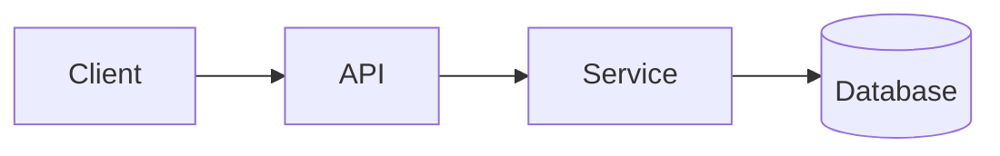

# PlanUI

AI agents shove walls of markdown into chat when they present a plan. **PlanUI turns that into a scannable HTML page** with inline answer fields, fork toggles, and a one-click action bar. No daemon, no server — just a markdown file, an HTML file, and the clipboard.

## Install / Upgrade / Uninstall

```bash
# Fresh install (or run anytime to re-bootstrap)
npx -y @prathamux/planui@latest setup

# Upgrade an existing install to the newest published version
npx -y @prathamux/planui@latest upgrade

# Remove the MCP entry + slash command (rendered plans are left alone)
npx -y @prathamux/planui@latest uninstall
```

The `@latest` suffix is important — without it, npx will reuse the cached older version forever. The `upgrade` command also clears the npx cache so Claude Code's MCP server picks up the new binary on next restart.

`setup` does three things:
- Registers a `planui` MCP server in your Claude Code config (user-scoped)
- Drops a `/planui` slash command at `~/.claude/commands/planui.md`
- Renders + opens a Welcome plan in your browser

Restart Claude Code, then in any chat:

```
/planui add idempotency to /v2/refresh
```

The agent authors a structured plan and posts back a `file://` URL.

## How it works

1. You invoke `/planui <task>` in Claude Code.
2. The slash command tells the agent to author a PlanUI-conformant markdown plan (Summary, Open Questions, Steps, Risks, etc., with catalog blocks where structure earns elevation).
3. The agent calls the `render_plan` MCP tool with `{ title, markdown }`.
4. PlanUI writes `~/.claude-plans/<plan_id>.md` + `.html` — CSS, JS, and fonts are inlined or sibling; the only network call is the Mermaid library from jsdelivr, and only on plans that contain a ` ```mermaid ` diagram (with a graceful "raw source" fallback when offline).
5. You open the URL, fill in questions, toggle fork checkboxes on steps you want to fan out, then click **Approve**, **Modify**, or **Fork**.
6. The page copies a fenced `planresponse` block to your clipboard. You paste it in chat; the agent parses the action and acts.

## What you get

- **Section schema** — Summary, Open Questions, Preconditions, Steps, Risks, Files, Stack Changes. Unrecognized H2s render as note cards (nothing is lost).
- **Block catalog** — 7 typed components agents reach for when content has visible structure:
  - `block:layers` — precedence stacks
  - `block:compare` — side-by-side trade-offs
  - `block:sequence` — linear flows with arrows
  - `block:table` — styled GFM tables
  - `block:callout` — `[!info|warn|danger|success]` tinted cards
  - `block:metric` — number-on-top stat cards
  - `block:tldr` — editorial key-takeaway card
- **Mermaid diagrams** — fence with ` ```mermaid ` and PlanUI auto-themes the diagram to the active theme/accent. `flowchart`, `sequenceDiagram`, `erDiagram`, `stateDiagram-v2`, all of Mermaid's catalog. Library is loaded from jsdelivr on demand only when a plan contains a diagram; raw source fallback if offline.
- **Per-step Fork toggles** — check steps to queue them; the floating action bar shows `Fork N`. Pasting back the `fork` action tells the agent to spawn that many sub-agents in parallel.
- **Open Questions** — three input shapes: free-text textarea, `- ( )` radios, `- [ ]` checkboxes. The Approve button is gated until every question has an answer.
- **Inline chips** — `[mcp:server-name]` and `[tool:tool-name]` markers in any prose render as accent chips.
- **Live customization** — gear icon in the header opens a dropdown: theme (dark / midnight / light), font (sans Inter Display / serif Source Serif 4 / mono JetBrains Mono), primary color (blue / green / purple / white). Per-plan tweaks persist in localStorage; "Save as default" writes a `prefspersist` token that the agent applies to `~/.claude-plans/preferences.json` for every future render.

## Markdown conventions

| Header | Renders as |
|---|---|
| `## Summary` (or `Overview`, `TL;DR`) | Header summary |
| `## Open Questions` (or `Questions`) | Inline answer card (gates Approve) |
| `## Preconditions` (or `Requirements`, `Prerequisites`) | Compact card |
| `## Steps` (or `Plan`, `Implementation`) | Numbered list with file chips, Fork toggles, expandable descriptions |
| `## Files` (or `Files Touched`, `Affected Files`) | Monospace list |
| `## Risks` | Severity-coded card grid (`[high]` / `[med]` / `[low]`) |
| `## Stack Changes` (or `Changes to Stack`, `Dependencies`) | Additions/removals list |
| `## Status` | Status badge in header |
| _anything else_ | Note card with the heading preserved |

### Steps

```markdown
## Steps
1. **Add idempotency key check** — guard `/v2/refresh` against duplicate calls. `src/auth/refresh-token.ts`
2. **Update integration tests** — replace the dup-call mock with a real fixture. `tests/auth.test.ts`
3. **Deploy and monitor** (depends on 2) — flag-gate; watch the 4xx rate for 1h.
```

Use `(depends on N)` to disable Fork for blocked steps. File paths in backticks become chips.

### Risks

```markdown
## Risks
- Existing sessions invalidate during dual-write window [med] — mitigated by 24h overlap and gradual rollout.
```

### Block invocation

```markdown
## Persistence model

```block:layers
1. CSS defaults — what ships in the template
2. MCP-saved preferences — global user default
3. Browser localStorage — per-plan override
```
```

### Mermaid diagrams

````markdown
## System architecture


````

Pick the diagram type by intent: `flowchart` for architecture, `sequenceDiagram` for request flows, `erDiagram` for data models, `stateDiagram-v2` for lifecycles. PlanUI passes its CSS variables into Mermaid as theme overrides — diagrams re-render live when the user switches theme or accent color.

## Response grammar

When you click an action button, the page copies a fenced markdown block to your clipboard:

````
```planresponse plan_a3f9k2
approve
q1: yes, use Auth0
q2: migrate existing sessions
```
````

Five actions:

- **approve** — proceed with implementation. Body lines `qN: <answer>` for each question.
- **modify** — free-form revision feedback. The agent re-renders.
- **answers** — same as approve's body, but the agent re-renders before executing.
- **fork** — `steps: 3, 5, 7` — spawn these step numbers as concurrent sub-agents.
- **prefspersist** — `theme: midnight` / `font: serif` / `color: green` — saved to `~/.claude-plans/preferences.json` as the new global default.

## Why clipboard?

A `file://` HTML page is sandboxed and can't POST to a local process without a daemon, ports, lifecycle management, and security concerns. Clipboard gets ~90% of the value at ~5% of the complexity — and it works fully offline. A local HTTP server is on the roadmap as opt-in one-click.

## CLI usage (without Claude Code)

```bash
planui render path/to/plan.md "Plan title"
```

Prints the resulting `file://` URL. Useful for testing template changes by hand.

## Development

```bash
git clone https://github.com/prathameshagrawal/planui
cd planui
npm install
npm run build
node dist/cli.js setup    # registers against your local build
```

## Roadmap

- Light mode is shipped; mono mode is shipped
- Optional local HTTP listener (one-click instead of clipboard)
- Diff-block syntax highlighting (` ```diff `)
- Multi-pane preview for refactor plans
- `planui doctor` — diagnose misconfiguration

## License

MIT
