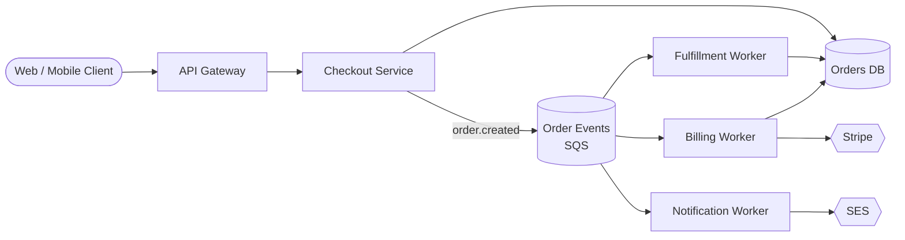
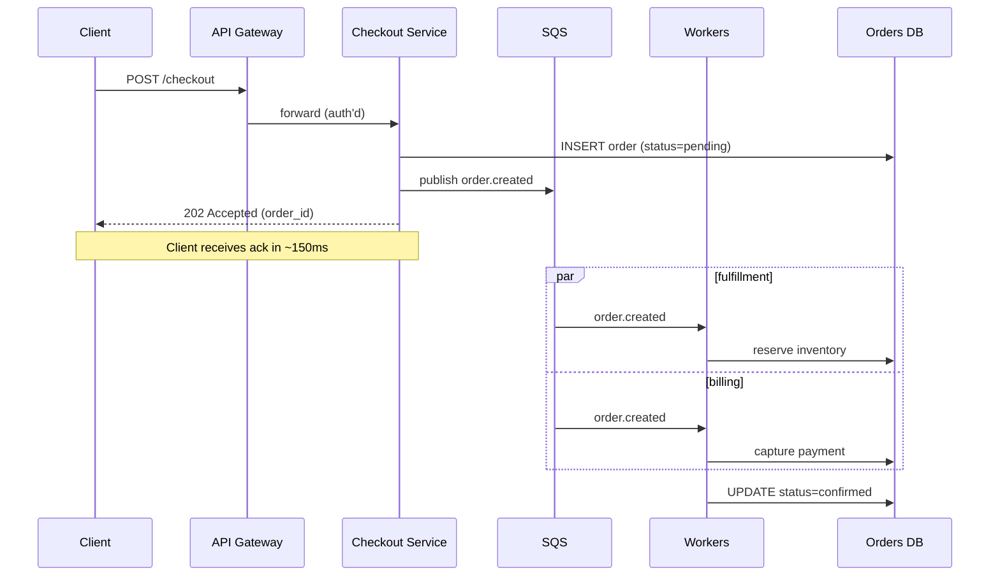
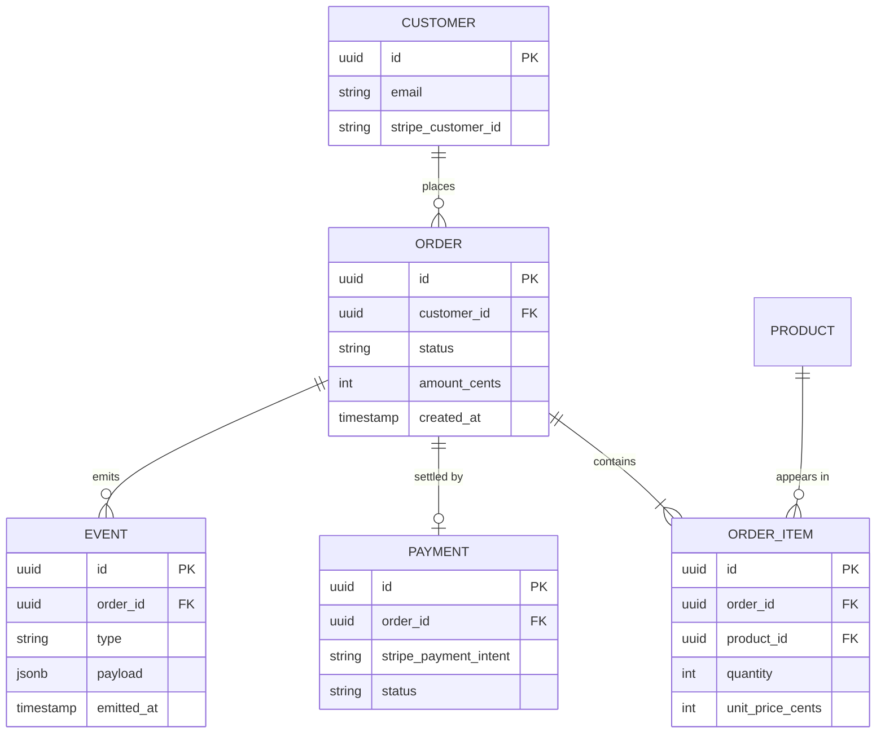

# Event-Driven Order Pipeline

## Summary

Refactor the current monolithic `/checkout` endpoint into an event-driven pipeline. Orders are accepted synchronously, then fanned out to fulfillment, billing, and notification workers via a durable queue. Goal: drop checkout p99 from 1.8s to under 300ms and stop coupling refund retries to live traffic.

## System architecture

## Request flow

## Data model

## Open Questions

- Do we keep `/checkout` returning `202 Accepted`, or block briefly to confirm payment authorization before returning?
  - ( ) Always 202 — workers handle everything async
  - ( ) Block up to 500ms for payment auth, fall back to 202
  - ( ) Keep current synchronous behavior, only fan out non-critical work
- Which queue technology? [tool:sqs] is our default but we've talked about Kafka for replay.
  - ( ) SQS (simpler, already deployed)
  - ( ) Kinesis (replay, but ops overhead)
  - ( ) Kafka via MSK (best replay story, biggest lift)
- Should `EVENT` table be the source of truth, or a side-effect log?

## Preconditions

- Stripe webhook handler already idempotent (verified 2026-04-12)
- SQS dead-letter queue provisioned in staging
- Feature flag `checkout.async_pipeline` available in [mcp:growthbook]

## Steps

1. **Stand up `order.created` event schema** — versioned, with a `schema_version` field. `src/events/order_created.ts`
2. **Wrap checkout writes in transactional outbox** — guarantees event publish iff DB commit succeeds. `src/checkout/handler.ts` `src/db/outbox.ts`
3. **Build fulfillment worker** — consumes from SQS, reserves inventory, writes back. `src/workers/fulfillment.ts`
4. **Build billing worker** (depends on 2) — captures payment, stamps `PAYMENT` row. `src/workers/billing.ts`
5. **Build notification worker** (depends on 2) — sends confirmation email via SES. `src/workers/notification.ts`
6. **Cut over behind flag** — 1% → 10% → 50% → 100% over a week. `config/flags.ts`
7. **Decommission inline fulfillment code path** (depends on 6) — remove the old synchronous handler. `src/checkout/handler.ts`

## Risks

- Outbox table grows unbounded if relay falls behind [high] — add a Cloudwatch alarm on `outbox_lag_seconds > 60`.
- SQS at-least-once delivery means workers must be idempotent [med] — billing worker uses Stripe idempotency keys; fulfillment uses `(order_id, item_id)` unique constraint.
- Client experience regresses if 202 confuses existing clients [low] — coordinate with mobile team; web already handles async.

## Files Touched

- src/checkout/handler.ts
- src/events/order_created.ts
- src/db/outbox.ts
- src/workers/fulfillment.ts
- src/workers/billing.ts
- src/workers/notification.ts
- config/flags.ts
- terraform/sqs.tf

## Changes to Stack

- Add: `@aws-sdk/client-sqs`, `pg-listen` for outbox relay
- Add: SQS queue `order-events` + DLQ
- Remove: inline `await sendConfirmationEmail()` call in checkout handler
